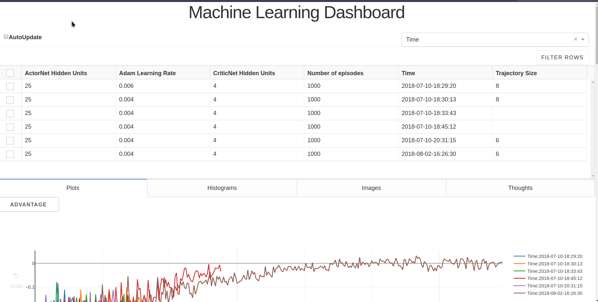
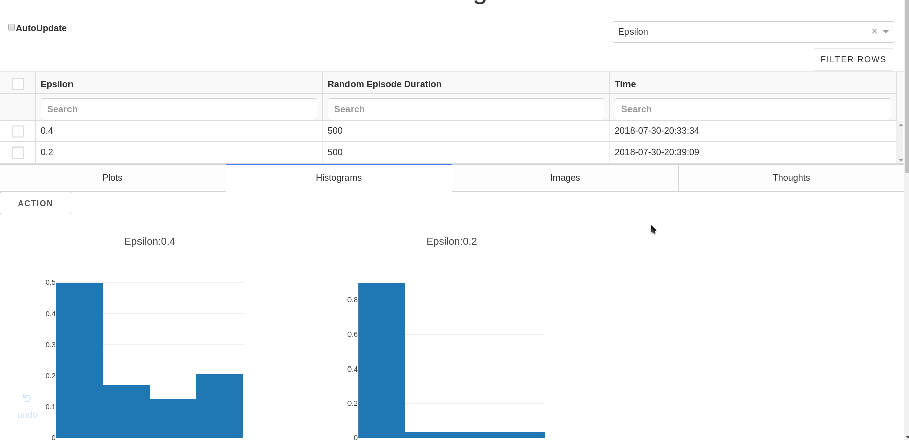

# ml_board
### Why ml_board/Limitations of Tensorboard
I decided to create this machine learning dashboard for my own personal usage after using [tensorboardX](https://github.com/lanpa/tensorboardX). As great as tensorboardX was in helping me debug and understand neural networks(it certainly beats printing out statistics to the terminal), I found myself using only a subset of its features, and also discover certain limitations about tensorboard

* **Text is buggy**: The text tab will sometimes take a long time to load, or it will load the text from another run. When training a machine learning model, I often go through many settings and test various hypotheses. So having a reliable log is a must.
* **Disconnect between visualization and settings**: My hypotheses often involve varying a hyperparameter and seeing its effect on quantities such as the loss, percentage of activations, etc. But the graphs don't have a legend that tells me which the setting each run used. As a result, I am forced to go back and forth between the Scalars and Text tab, interrupting my train of thought. As an example, if I were to log a bunch of experiments from random search, I would have put in a non-trivial amount of effort to remember which experiment used which setting(since the number won't montonically increase/decrease as in grid search)
* **Inadequate search**: Suppose I wanted to view all the runs that achieved a certain accuracy, or were run on a particular hyperparameter setting. As far as I know, this is not possible in tensorboard. So in some senses, past runs are only useful if I can remember them.

Although tensorboard has great visualization capabilities(embeddings,computational graphs,etc), it is not the best tool for tracking, presenting, and organizing the knowledge one obtains as they run through many machine learning experiments. So the focus of this dashboard will not be on[visualization](https://github.com/tensorflow/tensorboard), or experiment [organization and control](https://github.com/IDSIA/sacred), but on the relationship between model parameters and its output characteristics.
### Features
* **Filterable Table**: Allow individual selection of runs, can filter based on equality/inequality.



* **Legend Dropdown**: Allows you to choose the hyperparameter setting to be displayed for each run in the Plots/Histogram/Image Tabs. I only allowed one item to show up because I did not want the figures to be cluttered with words, which I believe is worth the tradeoff of uniqueness.


* **Figure/AutoUpdate Toggle**: As in tensorboard, you can click on the figure's title to minimize it. Also, every 10 seconds, the app will reread the data from the database, unless the autoupdate toggle is turned off.

* **Log of Thoughts**: Visual information takes up a substantial amount of space -> inevitably will lead to scrolling, a flow state killer. But if the user is only allowed to view the runs from a particular folder -> can easily forget purpose of the experiments. Thus, unlike the Plots/Images/Histograms, which only show the runs of a specific folder, this tab aggregates logged thoughts across all folders within the given database and displays them in order by time. 


**Extensibility(at least for me)**: Because I wrote this app, it will be much easier for me to extend its capabilities, since I have an intricate mental model of the codebase. Furthermore, the Dash library comes with awesome interactive components, such as the Table and Tabs components that were used in my project. 

I chose to use Dash to create my dashboard for its awesome library of interactive components! Because of this, I was able to create ...
* Dash components were the building blocks of all the features I have shown above.

# Installation
Until the tabs feature is integrated into the master branch of [dash](https://github.com/plotly/dash), and I do more testing, and write up the documentation, you will have to manually install the package with the following commands:
```
git clone https://github.com/bbli/ml_board.git
cd ml_board
conda create -n ml_board python=3.6.6 pip
pip install .
```
After this, just install MongoDB(and make sure it is running) and you are good to go!

If something goes wrong during usage, and you can't debug it, you can try installing the exact versions this package was tested on:
1. Commenting out the `install_requires` field in setup.py
2. run `pip install -r requirements.txt && pip install .`

# Usage
### Logging
Usage is more or less the same as tensorboard. One noticeable difference is that there is no need to specify a count, as ml_board will append the result to a MongoDB list. The other is that ml_board has an additional `add_experimental_parameter` which is intended to log hyperparameters to a table
```
from ml_board import SummaryWriter
w= SummaryWriter('name_of_mongodb_database','name_of_mongo_db_collection')

w.add_scalar("Loss",loss)
w.add_histogram()
w.add_image("Segmentation",2d_numpy_matrix_in_range_0_to_1)
w.add_thought("your_thoughts")
w.add_experimental_parameter("Hyperparameter",)
w.close()
```
For more details, look at the `Logger.py` file in the ml_board folder
### Visualizing
From the command line, do
```
ml_board --database_name name_of_mongodb_database --folder_name name_of_mongo_db_collection
# shorthand notation
ml_board --d name_of_mongodb_database --f name_of_mongo_db_collection
# specific port. Default 8000
ml_board --d name_of_mongodb_database --f name_of_mongo_db_collection -p 8050
```
pics of dashboard on top??
### Concerns
* if autoUpdate is on, do not filter rows as it will be overwritten
* don't click on the filter rows button twice, or it will filter permemantly. If this does happen, refresh the webpage to reset the app's state.
* only filter table when on Plots Tab(sometimes rendering of plot get buggy otherwise)


# TODO
* allow user to change folders from within the dashboard
* put priority on the callbacks(basically if I am on the Plots Tab, its callbacks should finish first)
* testing/documentation
